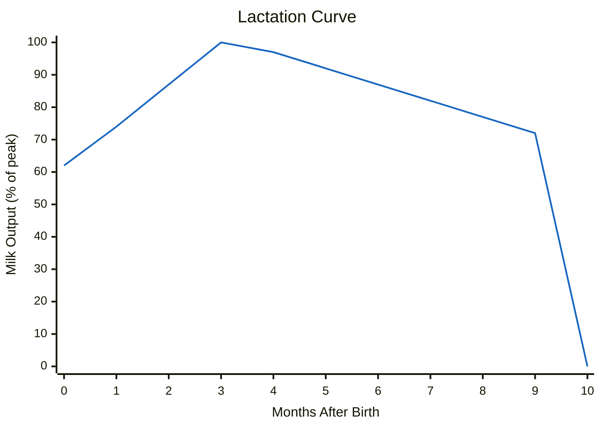

# Breeding Guide

Realistic Livestock RM replaces the base game's automatic reproduction with a realistic system requiring males and females, age requirements, health thresholds, and species-specific gestation periods. This guide covers everything you need to know about breeding.

> **Note:** This documentation was generated with AI assistance and may contain inaccuracies. If you spot an error, please [open an issue](https://github.com/rittermod/FS25_RealisticLivestockRM/issues).

---

## Requirements for Breeding

For reproduction to occur, ALL of the following must be true:

1. **Male and female** of the same species in the same pen (or artificial insemination)
2. Female has reached **minimum breeding age**
3. Male has not exceeded **maximum breeding age**
4. Female is **not already pregnant**
5. Female health is **75% or above**
6. Female is not the **daughter of that specific male** (inbreeding prevention)

---

## Breeding Ages & Gestation

| Species | Female Breeds From | Male Breeds From | Male Breeds Until | Gestation | Female Fertility Ends |
|---------|-------------------|-----------------|-------------------|-----------|----------------------|
| **Cattle** | 12 months | 12 months | 132 months (11 yr) | 10 months | 132 months (11 yr) |
| **Pigs** | 6 months | 8 months | **48 months (4 yr)** | 4 months | 96 months (8 yr) |
| **Sheep** | 8 months | 5 months | **72 months (6 yr)** | 5 months | 120 months (10 yr) |
| **Goats** | 8 months | 5 months | 72 months (6 yr) | 5 months | 120 months (10 yr) |
| **Horses** | 22 months | 24 months | 300 months (25 yr) | 11 months | 264 months (22 yr) |
| **Chickens** | 6 months | 6 months | 72 months (6 yr) | 2 months | 60 months (5 yr) |

*See the [Breeding Reference](reference-breeding.md) for a per-breed view that splits female and male rows and includes peak litter sizes.*

> **Critical insight:** Males retire from breeding much earlier than females in some species! Boars stop at 4 years while sows breed until 8. Rams stop at 6 years while ewes breed until 10. Plan male replacements early.

> **Genetics matter:** A male's maximum breeding age is scaled by his fertility genetics. A bull with high fertility may breed well beyond 11 years, while one with poor fertility may retire much sooner. The ages above assume average genetics. The one exception is roosters, whose 72-month cap is fixed and not affected by genetics.

---

## Breed Restrictions

Most males can breed with any female of their species, with two important exceptions:

| Male | Can Breed With |
|------|---------------|
| **Water Buffalo Bull** | Water Buffalo cows **only** |
| **Ram Goat** | Goats **only** |
| Any other Bull | Any cow breed (except Water Buffalo) |
| Any other Ram | Any sheep breed (except Goats) |
| All Boars | Any pig breed |
| All Stallions | Any horse colour |
| All Roosters | Any hen |

*Cross-breeding between different breeds of the same species is allowed (e.g., Angus bull × Holstein cow), except for breed-locked types. See [Offspring Breed](#offspring-breed) below for what breed the offspring will be.*

---

## Offspring Breed

When two different breeds produce offspring, each baby independently has a **50/50 chance** of inheriting either parent's breed. There is no visual blending -- the offspring will look exactly like one parent's breed or the other.

| Breeding Pair | Possible Offspring |
|---------------|-------------------|
| Angus bull × Holstein cow | Each calf: 50% Angus, 50% Holstein |
| Highland bull × Hereford cow | Each calf: 50% Highland, 50% Hereford |
| Landrace boar × Berkshire sow | Each piglet: 50% Landrace, 50% Berkshire |
| Landrace ram × Steinschaf ewe | Each lamb: 50% Landrace, 50% Steinschaf |

*Same-breed parents always produce same-breed offspring.*

### Litters and Twins

Each offspring rolls its breed independently. A Berkshire sow bred by a Landrace boar could produce a mixed litter -- some piglets are Landrace, others are Berkshire. The same applies to sheep twins or cattle twins: each baby gets its own 50/50 roll.

**Example:** A Berkshire sow produces a litter of 12 piglets sired by a Landrace boar. On average, about 6 will be Berkshire and 6 will be Landrace -- but any specific litter might skew 8/4 or even 10/2 by chance, just like flipping a coin 12 times won't always give exactly 6 heads.

### Artificial Insemination

When using artificial insemination, offspring **always inherit the mother's breed**. The AI semen system doesn't carry breed information from a specific sire, so all offspring will be the same breed as their mother.

If breed consistency matters to you, AI is a reliable way to ensure it.

### Breed vs Genetics

Don't confuse breed inheritance with genetic trait inheritance -- they work differently:

| Aspect | How It Works |
|--------|-------------|
| **Breed** (appearance) | 50/50 coin flip -- one parent's breed or the other, no blending |
| **Genetics** (traits) | Always blended from both parents, regardless of breed outcome |

A Holstein calf from an Angus bull × Holstein cow cross inherits its Holstein appearance, but its productivity, health, fertility, and other genetic traits are still a blend of both the Angus father and the Holstein mother. The same applies in reverse for an Angus calf from the same pairing.

*In other words: cross-breeding doesn't affect genetic inheritance. Your offspring's traits are always influenced by both parents -- only the visual breed is one-or-the-other.*

### Practical Tips

1. **Want breed-pure offspring?** Use same-breed parents, or use artificial insemination.
2. **Cross-breeding for genetics?** If the best bull in your pen is a different breed, the offspring will still inherit his genetic traits -- they'll just look like one breed or the other.
3. **Selling cross-bred litters?** Breed affects sell price (e.g., Berkshire pigs sell for more than Black Pied). In a mixed litter, each piglet's value depends on which breed it inherited.

---

## Offspring per Birth

Two things decide how many young you get: whether the mother conceives at all, and how large the litter is once she does.

- **Chance of conceiving** rises once the mother reaches breeding age, stays high through her prime years, and tapers to zero at her fertility end age (see the table above). This is the part that depends on age.
- **Litter size** does *not* depend on age. Each birth is usually the species' typical size; a smaller or larger litter is driven by the mother's **fertility genetics**, not how old she is.

### Cattle

Cattle almost always produce a single calf. Twins and triplets can happen, more often from cows with high fertility genetics.

| Outcome | Likelihood |
|---------|------------|
| 1 calf | Most likely |
| Twins | Uncommon |
| Triplets | Rare |

*A cow's chance of conceiving stays steady through her prime years and tapers to zero by 132 months.*

### Pigs

Pigs produce the largest litters -- typically around 12 piglets, and up to 16 from a highly fertile sow.

| Outcome | Likelihood |
|---------|------------|
| ~12 piglets (typical) | Most likely |
| Smaller litter | Uncommon |
| Up to 16 piglets | Possible with high fertility |

*A sow stays highly fertile through her prime years, with her conception chance tapering to zero by 96 months (8 years).*

### Sheep & Goats

Sheep and goats usually produce twins. Singles and triplets both occur, with triplets more likely from high-fertility ewes and does.

| Outcome | Likelihood |
|---------|------------|
| Twins | Most likely |
| Single | Common |
| Triplets | Uncommon |

*Twins are the most common outcome at every age, including first-time mothers. Goats breed from the same age as sheep (8 months). Conception chance tapers to zero by 120 months (10 years).*

### Horses

Horses almost always produce a single foal. Twins are an occasional surprise and triplets are rare.

| Outcome | Likelihood |
|---------|------------|
| 1 foal | Most likely |
| Twins | Occasional |
| Triplets | Rare |

*A mare stays fertile across her breeding years, with her conception chance tapering to zero by 264 months (22 years).*

### Chickens

A successful hatch is typically around 5 chicks, and can reach up to 12 from a highly fertile hen.

| Outcome | Likelihood |
|---------|------------|
| ~5 chicks (typical) | Most likely |
| Fewer chicks | Common |
| Up to 12 chicks | Possible with high fertility |

*A hen's chance of hatching a clutch is high from 6 months and tapers with age, ending abruptly at 60 months (5 years) -- after that she still lays eggs but hatches no chicks.*

---

## Lactation

Cows and goats enter a lactation period after giving birth. This has major effects on both production and consumption.

| Parameter | Value |
|-----------|-------|
| Duration | 10 months after birth |
| Milk production | Only during lactation (zero otherwise) |
| Food consumption | Noticeably higher during lactation |
| Water consumption | Considerably higher during lactation |
| Sell price | Small bonus while lactating |

### Lactation Phase Curve

Milk output varies within the lactation period:

| Months Since Birth | Milk Output |
|-------------------|-------------|
| 0-1 | Ramping up (below full potential) |
| 2-3 | **Peak production** |
| 4-9 | Gradually declining |
| 10+ | Lactation ends (zero milk) |

*Peak milk production occurs around month 2-3 after birth. See the cattle and sheep factsheets for specific breed output ranges.*

*Chart shows the lactation factor as a percentage of peak output (month 3). Production starts at ~62% of peak at birth and declines gradually, dropping to zero at month 10. Actual litres depend on breed and genetics - see the cattle factsheet for specific ranges.*

---

## Pregnancy Complications

Breeding requires the mother to be at 75% health or above to conceive (see [Requirements](#requirements-for-breeding)). Once she is pregnant, birth is usually safe, but complications can still occur:

- **Stillbirths.** An individual newborn may not survive birth. This is more likely when the newborn has poor health genetics. It reduces how many of the litter survive -- it does not shrink the litter the mother conceived.
- **Mother death.** If a newborn is stillborn, the mother herself can die during the birth. This is rare, and only a real risk for mothers with poor health genetics; strong health genetics make it very unlikely.

*Litter size is set by the mother's fertility genetics, not by her health -- health decides how safely the birth goes, not how many young she carries. If the mother dies during birth, her surviving offspring remain.*

### Freemartin Effect (Cattle Only)

When a cow gives birth to twins where one is male and one is female, the female calf has a **97% chance of being infertile** (a "freemartin"). This is a real biological phenomenon. The male twin is unaffected.

*Freemartins can still be raised for milk or sold, but they will never breed. This only affects mixed-sex cattle twins - same-sex twins are not affected.*

---

## Pen Capacity

If a pen is at maximum capacity when offspring are born, **excess newborns are automatically sold**. Make sure your pens have room for new arrivals, especially:

- Pig pens (litters of 11-16)
- Sheep pens at prime age (frequent twins)
- Any pen during peak breeding season

---

## Artificial Insemination

If you don't want to keep males, artificial insemination (AI) is available through the livestock menu. Press **I** on a female animal to open the insemination dialog.

- Breeds your female without needing a physical male in the pen
- Uses an AI animal pool (can be refreshed in settings)
- Offspring always inherit the mother's breed, so there is no need for breed-matched semen (even for Water Buffalo or goats)
- The female must meet the age and eligibility rules, but AI does not enforce the 75% health minimum that natural breeding requires
- The insemination button is automatically disabled when the female is ineligible (pregnant, too young, or recovering from birth)

---

## Breeding Calendar

Plan your breeding based on gestation periods:

| Species | Breed | Birth | Next Possible Breeding |
|---------|-------|-------|----------------------|
| Cattle | Month 0 | Month 10 | ~Month 12 (after lactation) |
| Pigs | Month 0 | Month 4 | ~Month 5 |
| Sheep | Month 0 | Month 5 | ~Month 6 |
| Goats | Month 0 | Month 5 | ~Month 6 |
| Horses | Month 0 | Month 11 | ~Month 12 |
| Chickens | Month 0 | Month 2 | ~Month 3 |

*Cows have the longest cycle - roughly one calf per year at best. Pigs can produce 2-3 litters per year, making them the fastest-reproducing large animal.*

---

## Tips

1. **Track male ages.** The #1 surprise is boars stopping at 4 years. Set up reminders or check your boar ages regularly.

2. **Actively manage your breeding stock.** Offspring inherit from parents, but individual calves can be worse than either parent due to natural genetic variation. Pair your best animals, sell or castrate underperformers, and don't let a herd breed unchecked through generations - genetics will drift towards average without active culling. See the [FAQ](faq.md#how-can-offspring-have-worse-genetics-than-their-parents) for why this happens.

3. **Keep health above 75%.** Below 75%, breeding fails entirely. Weak newborns (poor health genetics) can be stillborn, and a stillbirth can occasionally cost the mother too. Good food, water, straw, and medical treatment are essential.

4. **Budget for lactation costs.** Lactating cows eat noticeably more food and considerably more water. Plan your feed budget for the 10-month lactation window.

5. **Use pen capacity wisely.** A pig sow can produce 13 piglets at once. If your pen only has 5 spaces, 8 piglets get auto-sold at newborn prices. Expand pens before breeding season.
